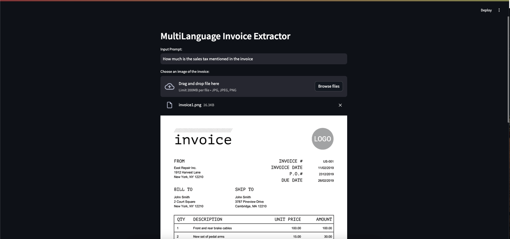
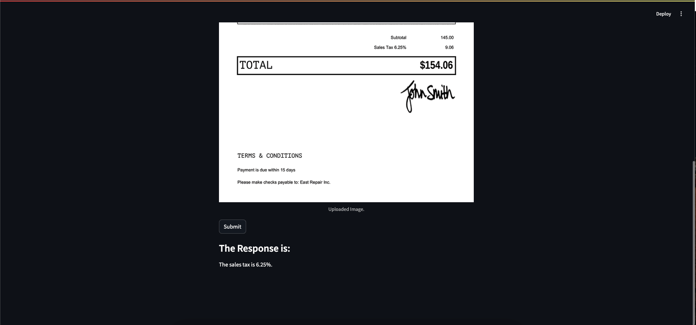
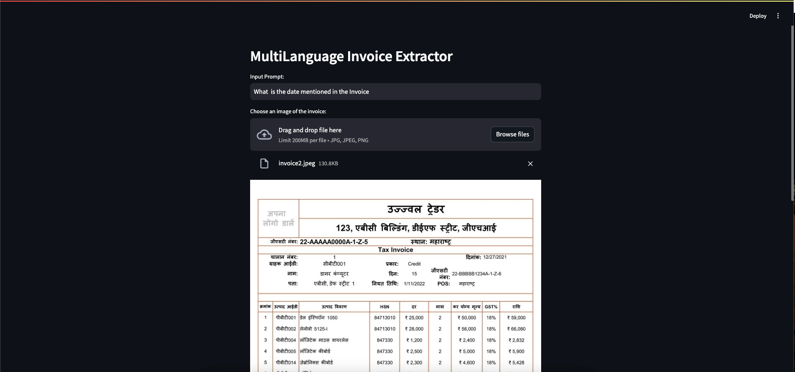

# Gemini Application: MultiLanguage Invoice Extractor

Welcome to the Gemini Application! This tool leverages the power of the Gemini Pro Vision model to understand and extract information from invoices. By uploading an image of an invoice, users can ask questions related to the content of the invoice and receive accurate responses.

## Features
- **Upload Invoice Images**: Easily upload images in JPG, JPEG, or PNG formats.
- **Interactive Text Input**: Provide prompts or questions regarding the invoice.
- **AI-Powered Extraction**: Utilize the Gemini Pro Vision model to understand and respond to queries about the uploaded invoice.

## Working Images

