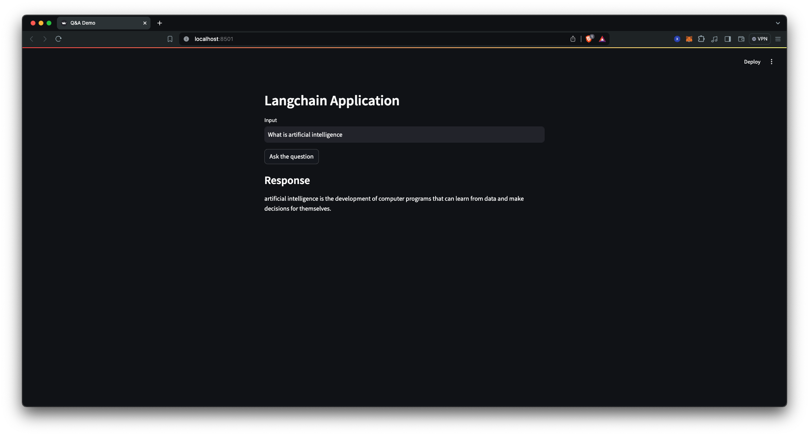
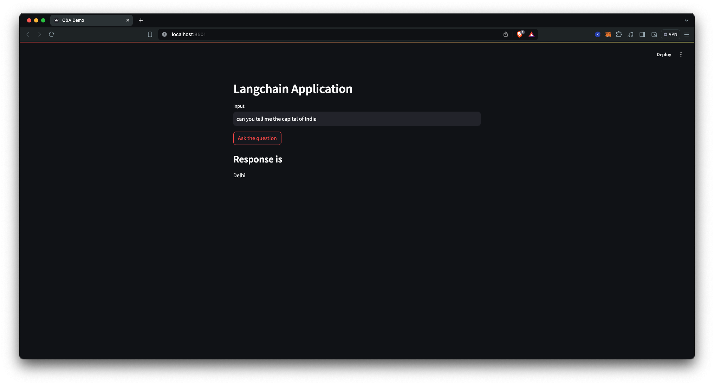

# LangChain Q&A Chatbot with Streamlit & Hugging Face

LangChain Q&A Chatbot with Streamlit is a basic conversational agent designed to assist users with language-related queries. Built with Streamlit, a simple and intuitive web application framework for Python, this chatbot provides an easy-to-use interface for interacting with language-related questions.

## Working Images

